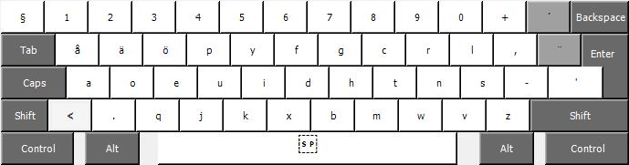

#Svorak A2
Svorak A2 är benämningen på den Dvorak-baserade tangentbordslayouten som jag använder och har anpassat själv. Layouten är samma som finns på [aoeu.info](http://aoeu.info) och där benämns Svorak. Magnus på aoeu.info har tagit fram layouten han kallar Svorak A5 och flyttat på specialtecken. Jag har bara flyttat ner de specialtecken som är vanligast när man skriver C/C++/C#/Java/JavaScript för att kunna skriva specialtecken med AltGr (höger tumme) och vänster hand. Alla tecken som är klamrar har placerats för att ha en rullande rörelse inåt. 

##Svorak A2 - normalläge

##Svorak A2 - AltGr

Som synes så ligger alla specialtecken som skrivs med AltGr kvar på sina vanliga platser också. Detta pga att det på senare tid har dykt upp en del verktyg som hittar på egna kortkommandon och om det ligger på AltGr + A så kan det ibland vara svårt att skriva { om det inte finns ett alternativ som inte är ett kortkommando. 

##Namnsättning
Jag har döpt min layout till Svorak A2 för att det är den svenska variant som finns på [aoeu.info](http://aoeu.info) och oftast verkar gå under namnet Svorak med sin placering av åäö. A2 kommer av den "namnstandard" som Magnus införde när han benämnde dem till A1 och A5. Eftersom jag flyttat på färre tecken en A5 tycker jag att A2 duger. [Erwan Lemonnier](http://erwan.lemonnier.se/svorak.php) verkar ha anammat samma namnstandard med sin Svorak R1. 

##Nedladdning
Installationsfiler kan laddas ner [här](https://github.com/dahermansson/SvorakA2)